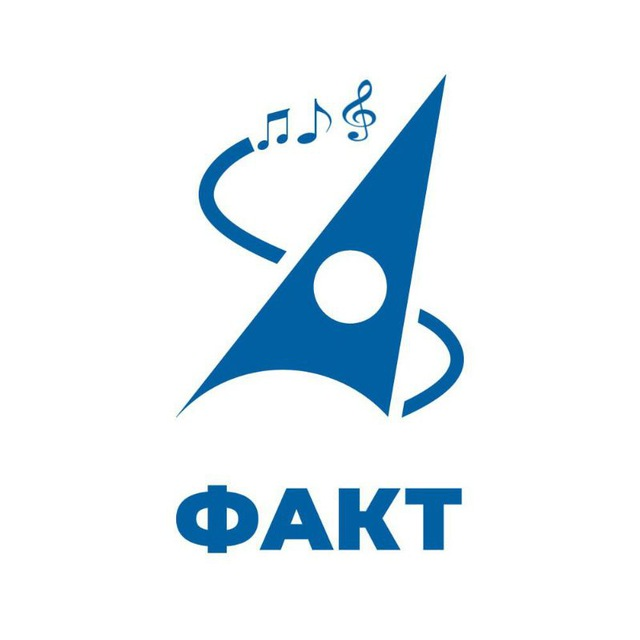

# ФАКТ.Синтезатор

DIY синтезатор, разработанный и собранный командой студентов второго курса ФАКТ МФТИ.

## Струкрура репозитория
- __docs/__ - руководство пользователя к синтезатору, логотип команды
- __archive/__ - исходный код проекта на начальном этапе разработки
- __src/__ - исходный код, Arduino IDE
## Полезные ссылки
- [Презентация](https://docs.google.com/presentation/d/1jiTuCDYLhv5Om5ewJSXBUfSQBudySQsCCXH7HL0cz3s/edit?usp=sharing) проекта в Google Docs
- Telegram-канал [ФАКТ.Синтезатор](https://t.me/DIY_Synth)
- Raspberry Pi Pico [распиновка](https://www.raspberrypi.com/documentation/microcontrollers/images/pico-pinout.svg)
## Использованные инструменты
- Микроконтроллер RP2040 ([Raspberry Pi Pico](https://www.raspberrypi.com/products/raspberry-pi-pico/))
- Среда разработки (IDE) [Arduino IDE](https://www.arduino.cc/en/software)
- RP Pico [Arduino core](https://github.com/earlephilhower/arduino-pico)
- Библиотека для синтеза звука [Mozzi](https://sensorium.github.io/Mozzi/)
## Подробнее о продукте
Разработан в рамках _курса общеинженерной подготовки_ при поддержке [Физтех.Фабрики](https://miptfab.ru/).    
Основные функции:
- Выбор из пяти октав
- Клавиатура из 13 кнопок (октава + 1)
- Три вида сигнала - синусоида, треугольник, прямоугольник
- Регулировка громкости

Ключевые особенности:
- Подключение к микшеру/колонке через разъём jack 6.35мм
- Питание от батареек AA (2 шт.)
- Индикация работы
- Корпус из дерева

## Этапы разработки, возникшие трудности
1. Сбор команды, распределение задач
2. Выбор микроконтроллера, написание hello world со светодиодом на C
3. Создание telegram-канала, репозитория и презентации
4. Прохождение курса работы с электроникой на Физтех.Фабрике, покупка аудио разъема
5. Изучение готовых продуктов, их сравнению (спасибо Евгению с Физтех.Фабрики!)
6. Создание прототипа клавиатуры из 12 тактовых кнопок
7. Получение первой звучащей ноты (440Гц синусоида) с помощью ЦАПа на ШИМе (бибиотека Mozzi)
8. Покупка готового детского синтезатора, изучение его устройства и схемы питания, попытка использовать его клавиатуру
9. Фильтрация шумов, применили RC-фильтр с частотой 6 kHz (R = 270Ω, C = 100nF)
10. Реализация смены пяти октав
11. Прохождение курса по раскрою на станках с ЧПУ и лазерной гравировке
12. Реализация смены формы сигнала (синус, пила, меандр)
13. Начало переноса синтезатора с беспаечной макетной платы на плату для пайки
14. Создание прототипа корпуса
15. _Возгорание батарейного отсека_
16. ...

__Больше информации__ (дневник разработки, примеры звучания, анонсы) можно найти в нашем telegram-канале.
